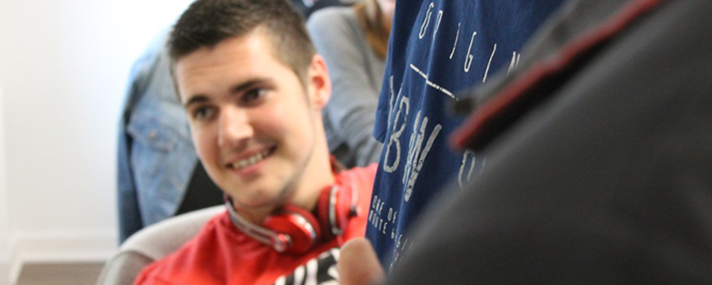

I'm Maxime, a 22 year old front-end developer from France. I'm specialized in Angular 1.x and Angular 2 but also in Highcharts, a Javascript chart library. I'm a Freelancer since 2k15 with my group: [Arcadmedia](//arcadmedia.com). I love food (especially asian food 🍣), playing rugby with friends (I play as second row since 2008), and contributing to [open source](//github.com/maximelafarie) projects.

  

You may ask : "Why are you writing in english while you're french?". That's simple: I love writing about dev, tech an off topic themes but the problem is everybody don't understand french. So if I want to reach a large part of people, I have to write in english but no worries french friends, I probably will write some articles in both languages.

### Timeline

| Date | Comments |
| ---- | ---- |
| 27.06.2015 | DUT diploma in Computer Science, Web Developer course (Computer Science University of La Rochelle, 17) |
| 14.04.2015 | Front-End Developer at Raccourci Agency (La Rochelle 17) |
| 22.03.2015 | Visited Barcelona, Spain for the first time |
| 12.07.2012 | Baccalaureate in Sciences and Management Technologies, Third Class Honours (Saint-André Highschool, Niort 79) |
| 23.03.2009 | Visited Ludwigsburg, Germany for the first time |

### Contact

Want to hire me or contact me for a project? Please email me: maxime.lafarie[at]gmail[dotcom].

### Licensing
All code you see here is free to use however you see fit, however corresponding GitHub projects articles may mention usually have an MIT license.
